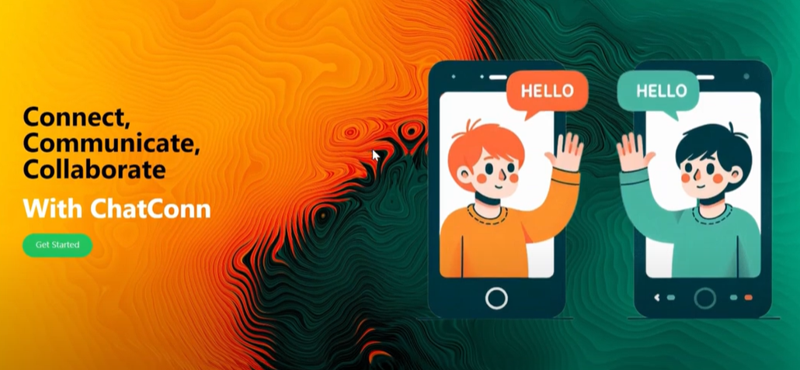

# Chat App

This is a simple chat application built with modern web technologies. The application allows users to communicate with each other in real-time.
## 🖼️ landing page

you can watch the demo on my youtube video:
---

## Features

- Real-time messaging
- User authentication
- Private and group chats
- Message history
- Responsive design

## Technologies Used

- Frontend: React, Redux, CSS
- Backend: Node.js, Express
- Database: MongoDB
- WebSockets: Socket.io

## Contact

For any inquiries, please contact [aitgouraine.youssef03@gmail.com].

